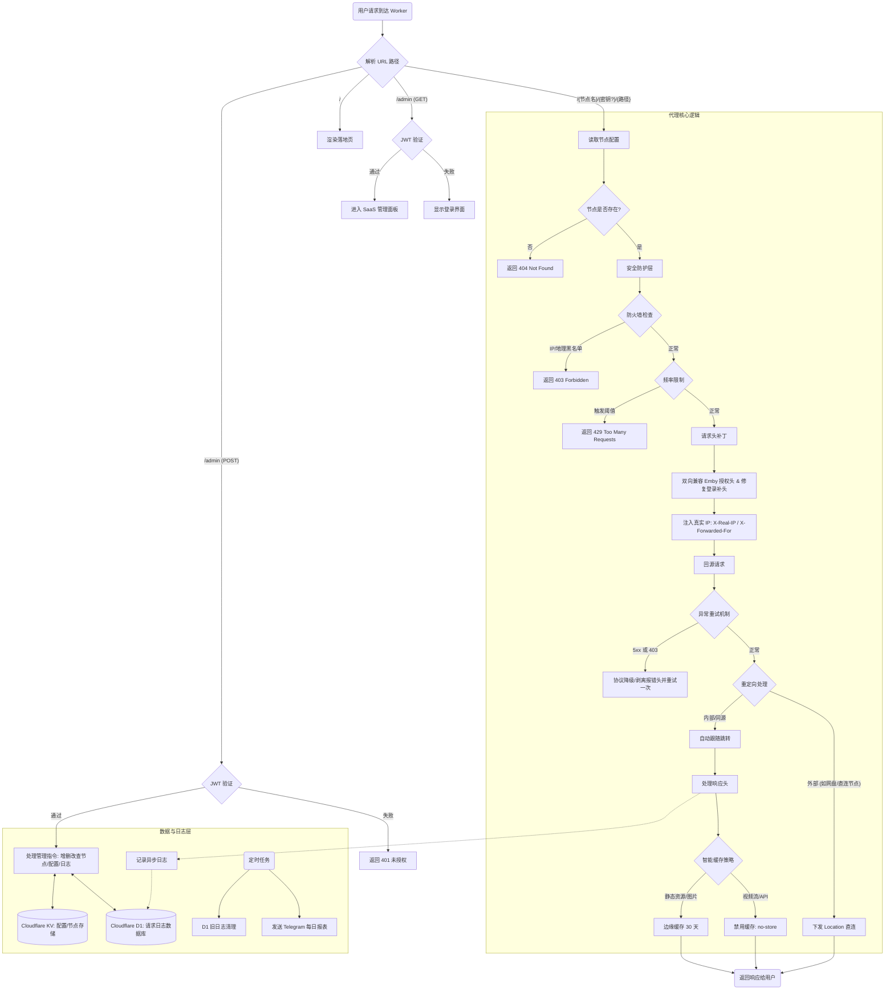

## CF-EMBY-PROXY-UI 最新版本：V18.0 

## 意见反馈群或者讨论群 https://t.me/+NhDf7qMxH4ZlODY9 

## 描述

**CF-EMBY-PROXY-UI**  是一个基于 **Cloudflare Workers** 边缘计算平台开发的高性能媒体代理与分流系统。它通过单文件 `worker.js` 实现了多台 Emby 服务器节点的统一管理、隐藏源站 IP 以及访问加速。
**面向个人，对于家庭来说免费版worker请求数不够用**

------

**核心架构**：利用 **Cloudflare KV** 持久化配置，结合 **D1 数据库** 实现日志审计与 Telegram 每日报表统计。

**智能流控**：内置静态资源边缘缓存与视频流无损穿透，支持网盘链接自动直连以节省带宽。

**可视化管理**：提供 SaaS 化后台（`/admin`），支持节点测速、配置导入导出及私密路径设置。

**安全兼容**：集成 Emby 授权头双向兼容补丁，解决反向代理环境下的客户端登录难题，并内置 IP/地理防火墙。

---

## 原理

**流量转发原理**：客户端通过代理链接发送请求到Worker指定访问EMBY源站，Worker 作为一个中间人，一方面修改请求头并发送请求到EMBY源站，一方面接受源站的数据以流式传输透传给客户端。HTTP(S)协议请求传输，WS协议保持心跳连接等

**IP隐藏原理**：借用Cloudflare 的边缘网络实现隐藏EMBY源站真实IP隐藏，起到隐藏和保护EMBY源站的作用。

---

## 需求前提

**访问EMBY源站直连差【EMBY源站在国外，线路不好】**  利用cloudflare加速访问

**多台服务器想统一入口【多台服务器需要EMBY反代】**，路由分流，URL路径分流。

**不想暴露EMBY源站的真实 IP**

**内网不需要**

**腐竹大概不需要**

**EMBY源站是国内机器/CN2，这类直连线路大概不需要**

---

## **须知前提**

**腐竹让不让使用cf反代**， 询问腐竹让不让使用cf反代？腐竹禁止国内IP访问，使用该项目可能会让你EMBY账号封禁

**关于请求头或ip**，代码从cf-connecting-ip获取ip赋值给x-real-ip和X-Forwarded-For，正常的话emby正常识别X-Real-IP，X-Forwarded-For，显示的ip为用户ip或代理ip,虽然代码中删除了关于cf标识的请求头，但cfworker会强制追加请求头例如 CDN-Loop CF-Ray CF-Worker。tcp层源ip显示的仍是cf ip，腐竹只要检查请求头就会知道这是cf反代。

**客户端支不支持反代** ，客户端可以选择小幻,hills,vidhub,senplayer,forward,afusekt,yamby 【我测试的hills和yamby没有问题】

**滥用的话cloudflare可能会暂停账号功能或是封号** ，项目已设置 `Cache-Control: no-store` 并禁用了 Cloudflare 对流媒体文件的缓存，符合 Cloudflare 服务条款中关于“非 HTML 内容缓存”的规定。 但请注意：如果您的日均流量过大（如 TB 级别），仍可能因占用过多带宽被 Cloudflare 判定为滥用（Section 2.8）。**建议仅用于个人或家庭分享**。

**请求预热**，可能会生成大量请求,使用该项目可能会让你EMBY账号封禁【须知】

**EMBY服禁用web问题** 客户端都是使用API进行调用不用担心WEB端

**端口要求**，支持任意的EMBY服端口反代，当你使用反代链接你必须使用CF支持的端口，CF支持的加密端口有：443, 2053, 2083, 2087, 2096, 8443 

---

## 域名设置

#### 【可选】**DNS记录**

 - 添加一条**CNAME解析** 用作worker加速 [CM大佬教程](https://blog.cmliussss.com/p/BestWorkers/)

#### **SSL/TLS** 

---概述

- 选择**完全** 【不要选严格】

---边缘证书  

- 开启**始终使用 HTTPS**  
- **最低 TLS 版本**选择TLS1.2 
- 开启**随机加密**  
- 开启**TLS 1.3**  
- 开启**自动 HTTPS 重写**  

#### 速度

---设置

- 开启**站点推荐设置** 

--- Smart Shield

- 开启**Smart Shield** 

#### 缓存

---配置

- **浏览器缓存 TTL** 【一天或很久】

---Tiered Cache

- 开启**Tiered Cache** 

####  网络

- 开启**WebSockets** 

---

## **环境变量一览**

| **变量名**   | **必填** | **作用**                                                     | **示例**              |
| ------------ | -------- | ------------------------------------------------------------ | --------------------- |
| `ENI_KV`     | ✅        | **必须在后台绑定 KV Namespace**，代码读写数据的数据库。      | (选择绑定的 KV)       |
| `ADMIN_PASS` | ✅        | 后台管理界面的登录密码。                                     | `MySuperPass123`      |
| `JWT_SECRET` | ✅     | 用于加密 Cookie 的盐值。不填则默认等于 `ADMIN_PASS`。修改此项会导致所有已登录用户掉线。 | `ComplexRandomString` |
|`DB`          | ×| 请求日志记录，日志查询，日志清理，每日报表统计|(选择绑定的 D1)|

---

## 温馨提示：

**定期手动备份：利用面板自带的 Export (导出) 功能，每添加几个重要节点就导出一份 JSON 存到本地。 KV 数据库一旦丢失，意味着辛辛苦苦保存的内容都会丢失**

**使用强密码：鉴于脚本没有验证码机制，请确保 ADMIN_PASS 足够复杂，防止被暴力扫描工具撞库。**

---

##  部署指南 (Step-by-Step)

### 第一步：创建 KV 命名空间

1. 登录 Cloudflare Dashboard。
2. 进入 **Workers & Pages** -> **KV**。
3. 点击 **Create a Namespace**。
4. 命名为 `EMBY_DATA` (或者任何你喜欢的名字)，点击 Add。

### 第二步：创建 Worker

1. 进入 **Workers & Pages** -> **Overview** -> **Create Application**。
2. 点击 **Create Worker**，命名建议为 `emby-proxy`，点击 Deploy。
3. 点击 **Edit code**，将本项目提供的 `worker.js` 代码完整复制进去。
4. 保存并部署。

### 第三步：绑定 KV 数据库 (关键)

1. 在 Worker 的设置页面，点击 **Settings** -> **Variables**。
2. 向下滚动到 **KV Namespace Bindings**。
3. 点击 **Add Binding**。
4. **Variable name** 填写：`ENI_KV` (**注意：也可以直接使用KV**)。
5. **KV Namespace** 选择第一步创建的 `EMBY_DATA`。
6. 点击 **Save and Deploy**。

### 第四步：创建 D1 数据库并绑定worker【可选】

1.在控制台进入：**Storage & Databases → D1**
2.创建一个新的数据库，例如：`emby_proxy_logs`创建完成后，返回 Worker 页面继续绑定。
3.再次进入：**Settings → Bindings**
4.添加一个 **D1 Database** 绑定：- 变量名：`DB`- 绑定目标：选择刚创建的 D1 数据库 **后续需要在UI界面-日志记录初始化DB**

如果你不准备使用日志功能，也可以暂时不绑定 D1；但推荐完整配置，以便后续查看请求记录与使用清理功能。

### 第五步：获取API令牌+zoneID+账户ID 【可选】

#### 先创建一个TXT文件用于保存获取API令牌+zoneID+账户ID

#### 第一部分：获取 Zone ID（区域 ID）与 账户 ID

1. **登录并选择网站：** 登录 Cloudflare 后，在主页点击你要操作的**网站域名**。
2. **页面下滑：** 进入网站概览（Overview）页面后，一直往下滑动。
3. **一键复制：** 在页面的**右下角**，你会直接看到 **区域 ID (Zone ID)** 和 **帐户 ID (Account ID)**。点击它们旁边的“点击复制”即可。

---
#### 第二部分：获取 API 令牌 (API Token)

1. **进入个人设置：** 点击页面右上角的**人像图标**，选择 **我的个人资料 (My Profile)**。
2. **找到令牌选项：** 在左侧菜单栏点击 **API 令牌 (API Tokens)**，然后点击右上角的 **创建令牌 (Create Token)** 按钮。
3. **套用模板（最简单）：** 找到 **自定义**
   **设置如图所示**

   

4。 **选择你的网站：** 在“区域资源 (Zone Resources)”这一栏的第三个下拉框中，**选择你的域名**。
5。 **生成令牌：** 直接滑到底部，点击 **继续以显示摘要 (Continue to summary)**，然后再点 **创建令牌 (Create Token)**。
6. ⚠️ **核心警告：立刻复制并保存页面上出现的那串很长的代码！** 这就是你的 API 令牌。**它只显示这一次**，关掉页面就再也看不到了。

---

**你想用这些信息来配置什么功能呢？** 如果你是为了做动态域名解析 (DDNS) 或者申请免费 SSL 证书，我可以继续为你提供极简版的下一步教程！

### 第六步：设置密码

1. 还在 **Settings** -> **Variables** 页面。

2. 在 **Environment Variables** 区域点击 **Add Variable**。

3. **Variable name** 填写：`ADMIN_PASS`。**Value** 填写你的后台登录密码。

4. **Variable name** 填写  `JWT_SECRET`  **Value** 填写随机生成字符串。

5. 点击 **Encrypt** (加密存储)，然后 **Save and Deploy**。

---

   ## 📖 使用说明

#### 1. 进入管理后台

访问地址：`https://你的Worker域名/admin`

* 输入在环境变量中设置的密码登录。
* 如果连续输错 5 次，IP 将被锁定 15 分钟。

#### 2. 添加代理节点

在后台左侧面板输入：

* **代理名称**：例如 `hk` 
* **访问密钥** (可选)：例如 `123`。如果留空，则公开访问。
* **服务器地址**：Emby 源站地址，例如 `http://1.2.3.4:8096` (不要带结尾的 `/`)
* **TAG标签**(可选)

点击 **立即部署**。

#### 3. 客户端连接

* **公开节点**：`https://你的Worker域名/HK`

* **加密节点**：`https://你的Worker域名/HK/123`

  只需要把原来的**EMBY源站链接**换成**节点链接**使用

  当客户端端口可以选填时，不用填写端口【默认443端口】

  **端口要求**：443, 2053, 2083, 2087, 2096, 8443 

#### 5. 数据备份

* 点击列表的 **导出** 按钮，可下载 `json` 备份文件。
* 点击 **导入** 可恢复数据或批量添加节点（支持热更新，缓存立即刷新）。
* 全局设置-账号与备份-备份与恢复 (全量 KV 数据)

---

## **速度**

**Cloudflare 线路质量**：用户本地网络连接到 Cloudflare 边缘节点的优劣（国内移动/联通/电信直连 CF 的效果差异很大）。一般情况下联通延迟最高 ，但是最近

**CF 与 EMBY源站的对等连接**：Cloudflare 美国/香港节点与 Emby 源站服务器链接 

**EMBY源站上行带宽** 无解 

**转码能力**：如果触发转码，取决于服务器 CPU/GPU 性能。

---

## **缓存**

**自动区分**：媒体文件（不缓存）和静态资源（图片、JS、CSS 字幕等缓存）TTL 设为 1 天

Workers Cache API 缓存 KV 读取结果，减少KV读写次数

**三级缓存**：结合内存级 NodeCache、Cloudflare 默认 caches 缓存以及底层的 KV 存储。内存层**拦截了 99% 以上的重复请求**，边缘缓存 (`caches`) 充当了“中间站”，它不随实例销毁而消失，能让新启动的实例快速找回配置。**KV 存储**则作为“最后的防线”，确保即使边缘缓存被清空，数据依然能从持久化磁盘中恢复。

Cloudflare 边缘缓存的强制策略30天

代码会将 KV 中的节点配置缓存到 Cloudflare 的边缘计算缓存中（`caches.default`），有效期 60 秒。

---

## **KV空间作用**

#### 1.节点信息持久化

- **节点数据存储**：以 `node:` 为前缀（如 `node:hk`）存储每个代理节点的详细配置，包括目标源站 URL、访问密钥（Secret）、自定义标签（Tag）及备注。
- **节点索引管理**：存储键名为 `sys:nodes_index:v1` 的 JSON 数组，记录所有已创建节点的名称列表，用于后台列表的快速加载。

#### 2. 全局系统配置

- **设置存储**：通过 `sys:theme` 键位保存所有全局配置，包括 H2/H3 协议开关、安全防火墙规则（IP/地理黑名单）、Telegram 机器人 Token 以及 Cloudflare API 联动信息。
- **运行时同步**：系统通过 `getRuntimeConfig` 函数定期从 KV 读取这些设置，并利用内存缓存（`ConfigCache`）优化读取性能。

#### 3. 安全防护与登录控制

- **防暴力破解**：使用 `fail:{ip}` 格式的键位记录每个访问 IP 的登录失败次数。
- **自动锁定机制**：利用 KV 的 `expirationTtl` 特性，当达到最大尝试次数（`MaxLoginAttempts`）时，会自动锁定该 IP 15 分钟（`LoginLockDuration`）。

#### 4. 仪表盘数据缓存

- **统计快照**：存储以 `sys:cf_dash_cache:{zoneId}:{date}` 为键的流量统计快照，包含今日请求数、视频总流量及每小时请求趋势图表数据。
- **性能优化**：通过缓存 Cloudflare GraphQL 的查询结果，避免管理后台在每次刷新时都产生高延迟的 API 调用。

#### 5. 多级缓存同步

- **状态协调**：当多个 Worker 实例（Isolates）运行时，KV 作为唯一的“真理来源”，确保不同节点或不同地理位置的请求都能读取到一致的最新配置。
- **配置热更新**：在后台保存配置后，代码会通过 KV 的写入操作触发全网节点的状态更新。

---

## **常见403 Access Denied问题**

1. **路径访问错误**：后台登录 /admin ，直接复制连接访问就好。EMBY自定义路径无解只能修改代码。
2. **缺少 Secret (密钥)**：你给节点设置了 Secret（例如 `123`），但访问时没有带上。
   - *正确访问方式：`domain.com/HK/123`*
   - *错误访问方式：`domain.com/HK`*
3. **KV 未绑定**：如果没有正确绑定 `ENI_KV`，脚本读取不到节点信息，也会导致找不到节点而拒绝访问（或报 500 错误）。

---

# 代码一览概述

---

## 核心功能模块

### 1. 重定向管理与修复

- **无限重定向保护**：代码中通过 `while` 循环处理 30x 状态码，并硬编码了 `redirectHop < 8` 的限制，若重定向超过 8 次则强制停止，防止陷入无限循环。
- **Location 自动重写**：在响应处理阶段，系统通过 `buildProxyPrefix` 函数将后端返回的 `Location` 头进行重构。如果重定向路径是绝对路径或同源路径，它会被加上 `/{节点名}/{密钥}` 前缀，确保后续请求依然通过 Worker 代理。

### 2. WebSocket 实时通讯

- **协议升级识别**：系统通过检查 `Upgrade` 请求头是否为 `websocket` 来识别长连接请求。
- **透明转发**：对于状态码为 `101` (Switching Protocols) 的响应，Worker 会直接建立双向隧道，支持 Emby 的播放控制和实时通知功能。

### 3. 智能缓存策略 (Smart Caching)

代码通过正则匹配 `proxyPath` 来区分资源类型，并应用差异化缓存：

- **静态资源加速**：针对图片（`EmbyImages`）、静态扩展名（`StaticExt`）及字幕文件，统一设置 `Cache-Control: public, max-age=86400`（即 24 小时）。
- **视频流防盗链优化**：
  - **禁用缓存**：对于识别为 `isBigStream`（视频大文件）的请求，强制设置 `Cache-Control: no-store`。
  - **Referer 剥离**：在构建回源请求时，如果是视频流、分片或播放列表，且未配置自定义 Header，系统会主动删除 `Referer` 头，以绕过源站的防盗链机制。
- **预热探测缓存**：针对播放器频繁发起的 `Range: bytes=0-1` 探测请求（`isHeadPrewarm`），代码提供了 180 秒的短时间缓存，以减轻源站压力。

### 4. Header 伪装与 IP 注入

- **隐私清洗**：代码定义了 `DropRequestHeaders` 集合，包括 `host`、`cf-connecting-ip`、`cf-ray` 等 Cloudflare 特有或敏感头信息，在回源前会统一删除。
- **真实 IP 传递**：系统获取 `cf-connecting-ip` 后，会手动注入 `X-Real-IP` 和 `X-Forwarded-For`，确保 Emby 后端能正确识别客户端真实 IP。
- **协议参数优化**：根据配置，系统会在 Header 中注入 `Connection: keep-alive`，并在必要时禁用 H2/H3 以换取更高的单线程兼容性。

---

## 代码流程图 (请求处理逻辑)

---

## 技术亮点与细节审查

* #### 1. 时区感知与本地化优化

  虽然 V18.0 代码中没有直接命名为 `isDaytimeCN()` 的函数，但代码在多个关键逻辑点硬编码了 **UTC+8** 偏移，确保了针对中国用户的精准服务：

  - **日报统计精度**：在 `Database.sendDailyTelegramReport` 中，通过 `now.getTime() + 8 * 3600 * 1000` 强制校准日期，确保报表在每天北京时间 0 点准确切换。
  - **流量趋势对齐**：在 `fetchCloudflareWorkerUsageMetrics` 中，小时级图表数据使用了 `(dt.getUTCHours() + 8) % 24` 进行对齐，使后台展示的请求趋势图完全符合国内用户的时间轴。
  - **晚高峰自动切换**：在 `Proxy.handle` 中，代码通过 `const utc8Hour = (new Date().getUTCHours() + 8) % 24` 判断当前是否处于 **20:00 - 24:00** 的晚高峰时段，并据此触发协议降级逻辑以确保稳定性。

  #### 2. 精准流媒体分流与缓存防御

  代码通过严密的正则匹配与条件判断，实现了流媒体的高效直传：

  - **特征识别**：`GLOBALS.Regex.Streaming` 定义了涵盖 `.mkv`、`.mp4`、`.flv` 等主流视频格式的正则。
  - **大文件拦截**：系统定义了 `isBigStream` 逻辑，排除掉播放列表（m3u8）和微小分片（ts/m4s）后，将真正的视频主体识别为大流。
  - **强制不缓存**：在响应头处理阶段，一旦命中 `isBigStream`，系统立即执行 `modifiedHeaders.set("Cache-Control", "no-store")`。这不仅保护了 Cloudflare 账户（防止因滥用带宽缓存被封），也避免了大量视频二进制数据挤占边缘节点的内存。

  #### 3. 代码鲁棒性与兼容性设计

  代码在 V18.0 中表现出了极高的灵活性，显著降低了用户的配置门槛：

  - **KV/DB 命名全兼容**：`Auth.getKV` 能够自动识别 `ENI_KV`、`KV`、`EMBY_KV` 或 `EMBY_PROXY`；`Database.getDB` 则兼容 `DB`、`D1` 或 `PROXY_LOGS`。这种设计避免了因环境变量命名微调导致的系统崩溃。
  - **双向授权头处理**：针对 Emby 的特殊认证机制，代码实现了 `X-Emby-Authorization` 与标准 `Authorization` 的双向自动兼容。无论客户端发送哪种头，系统都会补全另一方，极大提升了对不同版本 Emby 客户端的适配能力。
  - **登录防御补丁**：代码特别针对 `/users/authenticatebyname` 接口注入了 `Emby Client` 设备信息的 Mock 补丁，从协议层面解决了反代环境下某些客户端登录报“401 未授权”的顽疾。

## 安全建议

1. **JWT_SECRET**：确保在环境变量中设置了高强度的 `JWT_SECRET`。
2. **KV 绑定**：部署时必须手动绑定一个 KV 命名空间到 Worker，否则管理面板将无法保存任何节点信息。

---
