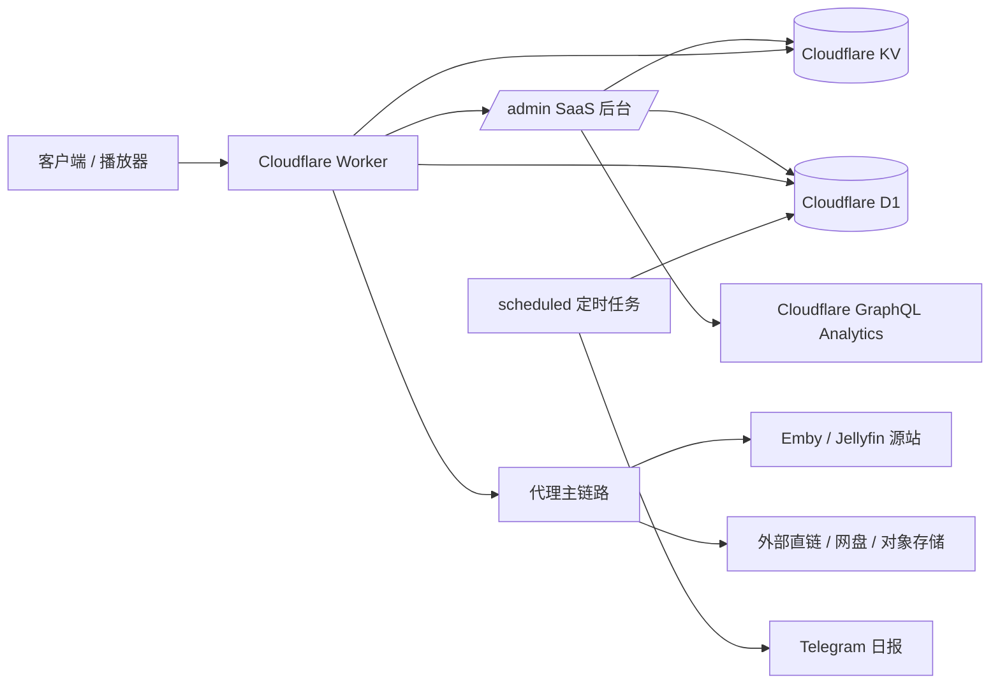
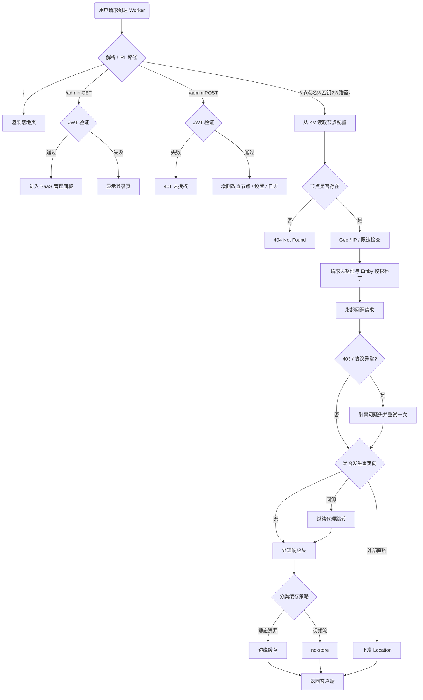

 # CF-EMBY-PROXY-UI

<p align="center">
  <strong>基于 Cloudflare Workers 的 Emby/Jellyfin 代理、分流与可视化管理面板</strong>
</p>

<p align="center">
  
  
  
  
</p>

> 一个单文件 `worker.js` 项目：统一多台 Emby 节点入口、隐藏源站 IP、支持直连/反代混合策略、提供 `/admin` 可视化后台，并集成日志、Cloudflare 统计、Telegram 日报与多层缓存优化。

> 当前版本 `V18.4`：新增 DNS 编辑（只读 Name、受限修改 Type/Content）、UI 圆角可配置（支持 0 直角），并补齐多处面板交互细节。


 - 讨论群：https://t.me/+NhDf7qMxH4ZlODY9
 - 这是一个面向个人的Worker 代理方案，对于家庭来说免费版worker请求数可能不够用
 - 建议每次新增多个节点后导出 JSON 做本地备份

## 目录

- [项目简介](#项目简介)
- [核心能力](#核心能力)
- [架构总览](#架构总览)
- [功能矩阵](#功能矩阵)
- [工作原理](#工作原理)
- [部署前须知](#部署前须知)
- [环境变量与绑定](#环境变量与绑定)
- [部署步骤](#部署步骤)
- [自定义域绑定与优选域名路由教程](#自定义域绑定与优选域名路由教程)
- [文档导航](#文档导航)
- [后台功能说明](#后台功能说明)
- [节点访问方式](#节点访问方式)
- [缓存与性能设计](#缓存与性能设计)
- [安全机制](#安全机制)
- [数据存储说明](#数据存储说明)
- [请求处理流程图](#请求处理流程图)
- [常见问题](#常见问题)

---

## 项目简介

**CF-EMBY-PROXY-UI** 是一个运行在 **Cloudflare Workers** 上的媒体代理系统，适用于：

- 多台 Emby / Jellyfin 服务器统一入口
- 隐藏源站真实 IP
- 为海外源站提供 Cloudflare 边缘加速
- 提供带 UI 的管理后台，而不是纯手改配置
- 实现“反代 + 直连”混合路由

项目当前版本在单文件内集成了以下模块：认证、KV/D1 数据管理、代理主链路、日志、可视化控制台、定时任务入口。代码头部也明确将其定义为单文件部署架构。 

---

## 核心能力

### 1) 可视化管理
- 后台地址：`/admin`
- 支持节点新增、编辑、删除、导入、导出
- 支持全局 Ping / 健康检查
- 支持仪表盘展示请求量、运行状态、流量趋势、资源分类徽章

### 2) 智能代理与分流
- 默认由 Worker 透明中继请求与响应
- 支持同源 30x 继续代理
- 支持显式“源站直连节点”名单
- 支持外链强制反代或直接下发 `Location`
- 内置 `wangpandirect` 关键词匹配，可识别网盘 / 对象存储链接并直连

### 3) 媒体场景优化
- 静态资源、封面、字幕与视频流分开处理
- 对大视频流强制 `Cache-Control: no-store`
- 对播放器起播探测请求支持微缓存（Prewarm）
- 支持 WebSocket 透明转发
- 支持 Emby 授权头双向兼容与登录补头修复

### 4) 安全与可观测性
- 登录失败次数限制，达到阈值自动锁定 15 分钟
- 国家/地区白名单、黑名单
- IP 黑名单
- 单 IP 请求限速（按分钟）
- 日志写入 D1、定时清理、Telegram 每日报表
- 支持 Cloudflare GraphQL 仪表盘统计与本地 D1 兜底统计

---

## 架构总览



---

## 功能矩阵

| 模块 | 说明 |
|---|---|
| 后台认证 | JWT 登录态，密码错误累计锁定 |
| 节点管理 | 节点增删改查、导入导出、备注/标签/密钥 |
| 路由模式 | 透明反代、同源跳转继续代理、源站直连节点 |
| 外链策略 | 强制反代外部链接 / 直接下发 Location |
| 网盘直连 | `wangpandirect` 关键词模糊匹配 |
| 缓存 | 静态资源缓存、视频 no-store、预热微缓存 |
| 安全 | Geo 白名单/黑名单、IP 黑名单、单 IP 限速 |
| 兼容补丁 | `X-Emby-Authorization` / `Authorization` 双向兼容 |
| 协议优化 | H1/H2/H3 开关、晚高峰自动降级、403 重试 |
| 日志监控 | D1 请求日志、清理任务、Telegram 日报 |
| 仪表盘 | Cloudflare GraphQL 聚合 + D1 本地兜底 |
| 连接能力 | HTTP(S) + WebSocket |

---

## 工作原理

### 请求转发原理
客户端请求先到 Worker，Worker 根据 URL 中的节点名读取 KV 中的节点配置，再构造回源请求发送到 Emby 源站；源站响应由 Worker 流式回传给客户端。对普通 API、静态资源、视频流、重定向、WebSocket，会分别走不同的处理分支。

### IP 隐藏原理
Worker 作为公网入口，外部只能看到 Cloudflare 边缘节点，而不是你的 Emby 源站真实 IP。需要注意的是，这种“隐藏”是网络入口层面的隐藏，不等于完全匿名：Cloudflare 仍会追加自身请求头，源站 TCP 层看到的也仍然是 Cloudflare 网络。

### 直连 / 反代混合原理
本项目不是“全量一刀切反代”。它支持：

- 节点默认走 Worker 中继
- 同源 30x 跳转继续代理
- 某些节点被显式标记为“源站直连节点”后，源站 2xx 可直接下发给客户端
- 命中网盘关键词或外链策略时，可直接把目标地址返回给客户端

这意味着它既能保留 Worker 统一入口，也能在带宽敏感场景下降低 Worker 中继成本。

---

## 部署前须知

### 适合什么场景
- Emby 源站在海外，直连线路差
- 多台服务器希望统一访问域名
- 不想暴露源站真实 IP
- 需要可视化后台维护节点

### 不太适合什么场景
- 局域网 / 内网直连环境
- 源站本身就在国内优质线路（如 CN2）
- 大规模公共分享、超大带宽分发

### 使用风险提醒
- 腐竹如果明确禁止 CF 反代，使用该方案可能导致账号受限
- Cloudflare 可能识别高流量滥用，建议仅用于个人或家庭分享
- Worker 并不能抹除所有 CF 痕迹，请求头和源 IP 识别仍有暴露反代特征的可能

---

## 环境变量与绑定

### 必需项

| 名称 | 必填 | 说明 |
|---|---:|---|
| `ENI_KV` | ✅ | KV Namespace 绑定；项目主配置、节点、失败计数、仪表盘缓存都依赖它 |
| `ADMIN_PASS` | ✅ | 后台登录密码 |
| `JWT_SECRET` | ✅ | JWT 签名密钥；未配置会导致后台认证不可用 |

### 可选项

| 名称 | 必填 | 说明 |
|---|---:|---|
| `DB` | 可选 | D1 绑定，用于请求日志、日志清理、日报统计 |
| `KV` / `EMBY_KV` / `EMBY_PROXY` | 兼容 | 代码兼容多种 KV 命名 |
| `D1` / `PROXY_LOGS` | 兼容 | 代码兼容多种 D1 命名 |

> 建议正式部署时仍统一使用 `ENI_KV` 和 `DB`，便于 README、面板和脚本保持一致。

### Worker 控制台变量配置示例

以下配置适合首次部署时直接对照填写：

| 变量名 | 必填 | 类型 | 作用 | 示例/说明 |
| --- | --- | --- | --- | --- |
| **`ENI_KV`** | ✅ | KV 绑定 | **核心存储**。用于持久化存储节点信息、系统配置和登录锁定状态。 | 绑定您创建的 KV 命名空间（如 `EMBY_DATA`）。 |
| **`ADMIN_PASS`** | ✅ | 加密变量 | **后台密码**。用于进入 `/admin` 管理面板。 | `MyStrongPassword123` |
| **`JWT_SECRET`** | ✅ | 加密变量 | **安全密钥**。用于生成登录状态的 JWT 校验，防止越权访问。 | 建议填入一段随机长字符串。 |
| **`DB`** | ❌ | D1 绑定 | **日志数据库**。开启请求日志审计、流量统计及日报功能的必要前提。 | 绑定您创建的 D1 数据库。 |

### SaaS UI 后台可选进阶参数

这些参数通常在 `/admin` 后台的“全局设置”中配置，最终存储在 KV 中：

| 参数名 | 建议 | 作用 | 说明 |
| --- | --- | --- | --- |
| **`cfApiToken`** | 💡 | **Cloudflare API 令牌** | 用于实现一键清理缓存、GraphQL 流量统计等联动功能。 |
| **`cfZoneId`** | 💡 | **区域 ID** | 对应您域名所在的 Zone ID。 |
| **`cfAccountId`** | 💡 | **账户 ID** | 对应您的 Cloudflare 账户 ID。 |
| **`tgBotToken`** | ❌ | **Telegram 机器人 Token** | 用于发送每日报表通知。 |
| **`tgChatId`** | ❌ | **Telegram 会话 ID** | 接收报表的个人或群组 ID。 |

### 可选触发器

| 名称 | 可选 | 作用 | 说明 |
| --- | --- | --- | --- |
| **`Cron Trigger` / `cron`** | ✅ | 定时清理日志、发送 Telegram 日报、驱动异常告警 | 这是 Cloudflare Worker 的定时触发器，不是环境变量或 Binding。社区里有时会误写成 `corn`，建议在 Dashboard 的 **Triggers** 中单独添加。 |

> 根据 Cloudflare 最新文档，Cron Trigger 表达式使用 UTC 时区，配置变更通常需要最多约 15 分钟才会传播到全球边缘节点。

### Cloudflare API Token 权限建议

若你希望启用 Cloudflare GraphQL 统计、缓存清理等完整能力，建议创建的 API Token 至少包含以下权限：

- **账户（Account）**：`Account Analytics`（Read）
- **账户（Account）**：`Workers Scripts`（Read）
- **区域（Zone）**：`Workers Routes`（Read）
- **区域（Zone）**：`Cache Purge`（Purge）
- **区域（Zone）**：`Analytics`（Read）
- **区域（Zone）**：`DNS`  (Edit)

> 如果你只打算使用基础代理与节点管理能力，而不需要仪表盘增强统计或一键清缓存，可以先不配置 `cfApiToken`。

---

## 部署步骤

### 第一步：创建 KV
1. 打开 Cloudflare Dashboard
2. 进入 **Workers & Pages -> KV**
3. 创建一个 Namespace，例如：`EMBY_DATA`

### 第二步：创建 Worker
你可以任选以下两种方式：

#### 方式 A：Cloudflare 控制台直接粘贴
1. 进入 **Workers & Pages -> Create Application -> Create Worker**
2. 创建后进入 **Edit code**
3. 将 `worker.js` 全量替换进去并部署

#### 方式 B：通过 Cloudflare 连接 GitHub 自动部署
1. 先将当前项目Fork到你自己的 GitHub 仓库
2. 在 Cloudflare 中进入 **Workers & Pages**，选择连接 GitHub 仓库创建 Worker
3. 选择本仓库后，保持仓库根目录为部署根目录
4. Cloudflare 会读取仓库内的 `wrangler.toml`，并以 `测试/worker.js` 作为入口文件
5. 如果你希望 Worker 名称与默认值不同，请先修改 `wrangler.toml` 里的 `name`

> 仓库中的 `wrangler.toml` 只用于声明 Worker 入口与兼容日期，**不会**通过 Wrangler 创建或绑定 KV / D1。

### 第三步：绑定 KV
1. 打开 Worker 的 **Settings -> Variables / Bindings**
2. 添加 KV Namespace Binding
3. 变量名填：`ENI_KV`
4. 绑定到你刚创建的 KV

### 第四步：绑定 D1（可选但推荐）
1. 打开 **Storage & Databases -> D1**
2. 创建数据库，例如：`emby_proxy_logs`
3. 回到 Worker 设置页，添加 D1 Binding
4. 变量名填：`DB`
5. 后续在后台“日志记录”页面执行初始化 DB

> 无论你是控制台粘贴部署，还是 GitHub + `wrangler.toml` 自动部署，KV / D1 都建议在 Cloudflare Dashboard 中手动绑定，不要放进 Wrangler 配置里统一管理。

### 第五步：设置环境变量
在 Worker 的 Variables 中新增：

- `ADMIN_PASS`：后台密码
- `JWT_SECRET`：随机高强度字符串

### 第六步：按需添加 Cron Trigger（可选 / cron，也有人误写成 corn）
如果你需要自动清理日志、发送 Telegram 日报或定时异常告警，再补这一步：

1. 打开 Worker 的 **Triggers**
2. 添加一个 **Cron Trigger**
3. 例如可先使用每天一次的表达式：`0 1 * * *`
4. 保存后等待 Cloudflare 全球传播生效

> Cloudflare 官方文档说明：Cron Trigger 使用 UTC，免费计划最多 5 个、付费计划最多 250 个；单次 Cron 执行最长 15 分钟。

### 第七步：绑定域名并配置 Cloudflare
推荐设置：

- SSL/TLS：**Full**
- 开启 **Always Use HTTPS**
- 开启 **TLS 1.3**
- 开启 **WebSockets**
- 可按需开启 **Tiered Cache**

> 反代访问端口需使用 Cloudflare 支持的 HTTPS 端口，例如 `443 / 2053 / 2083 / 2087 / 2096 / 8443`。

---

## 自定义域绑定与优选域名路由教程 可看

### https://blog.cmliussss.com/p/BestWorkers/


---

## 文档导航

如果你想快速理解当前版本里最容易看花眼的部分，建议按下面顺序阅读：

- [全局设置功能文档](./全局设置功能文档.md)：面向小白解释后台“全局设置”每一栏是干什么的、什么时候该改、什么时候别乱动
- [设置绑定词典](./worker-config-form-dictionary.md)：记录设置字段与界面输入框、默认值、加载/保存规则的对应关系
- [主流程图](./worker-flow.md)：从 `fetch / scheduled` 入口看整条请求链路怎么分发

---

## 后台功能说明

后台路径：

```text
https://你的域名/admin
```

### 后台主要页面
- **仪表盘**：展示请求量、流量趋势、资源类别、运行状态、定时任务状态
- **节点管理**：搜索节点、导入/导出配置、全局 Ping
- **日志记录**：查询请求记录、初始化 DB、手动清理
- **设置页**：系统 UI、代理网络、安全策略、日志监控、账号备份、快照恢复

### 设置页中可直接配置的能力

#### 系统 UI
- Dashboard 自动刷新开关
- Dashboard 自动刷新周期

#### 代理网络
- HTTP/2 开关
- HTTP/3 QUIC 开关
- 晚高峰自动降级到 HTTP/1.1
- 403 重试与协议回退
- 起播预热拦截（Prewarm）
- 预热微缓存时长
- 预热旁路预取字节数
- 静态文件直连
- HLS / DASH 直连
- 关闭旁路预热
- 307 直连命中时自动跳过 Prewarm / 旁路预热
- 同源跳转代理
- 强制反代外部链接
- `wangpandirect` 模糊关键词
- 源站直连节点名单
- Ping 超时时间
- 上游握手超时
- 额外重试轮次
- 一键恢复推荐值

#### 安全防护
- 国家/地区白名单
- 国家/地区黑名单
- IP 黑名单
- 全局单 IP 限速（请求/分钟）
- 图片海报缓存时长
- CORS 白名单

#### 日志与监控
- 日志保存天数
- 日志延迟写入分钟数
- 队列提前落盘阈值
- D1 单批写入切片大小
- D1 失败重试次数
- D1 重试退避时间
- 定时任务租约时长
- Telegram Bot Token
- Telegram Chat ID
- 日志丢弃批次告警阈值
- D1 写入重试告警阈值
- 定时任务失败告警
- 告警冷却时间
- 一键恢复推荐值
- 测试通知
- 手动发送日报

#### 全局设置上限说明
- Dashboard 自动刷新周期：5 到 3600 秒。
- 预热微缓存时长：0 到 3600 秒；`cf.cacheTtl` 只接受非负秒数。
- 预热旁路预取字节数：0 到 64 MiB；超过后会被自动钳制。
- 307 直连与预热联动：开启“静态文件直连”或“HLS / DASH 直连”后，命中的资源会自动跳过 Prewarm 与旁路预热。这一策略对应 Cloudflare 官方文档里“单次 Worker 调用最多 6 个同时打开连接”的限制，避免额外旁路预取继续吃掉连接预算。
- Ping 超时 / 上游握手超时：最高 180000 毫秒。
- 额外重试轮次：最高 3 次，避免额外消耗 Worker 子请求预算；Cloudflare 官方限制每次请求的子请求数量存在平台上限，免费计划与付费计划的额度不同。
- D1 单批写入切片大小：最高 100 条，避免单批过大。
- 定时任务租约时长：30000 到 900000 毫秒；对应 Cloudflare Cron 单次最长 15 分钟的官方限制。

#### 账号与备份
- 后台免密登录有效天数（JWT）
- Cloudflare Account ID / Zone ID / API Token
- 一键清理全站缓存（Purge）
- 导入完整备份 / 导出完整备份
- 导入全局设置 / 导出全局设置
- 设置变更快照列表与恢复

---

## 节点访问方式

### 后台新增节点时需要填写
- **代理名称**：例如 `hk`
- **访问密钥**：例如 `123`，为空则公开
- **服务器地址**：例如 `http://1.2.3.4:8096`
- **标签 / 备注**：可选

### 访问格式

公开节点：

```text
https://你的域名/hk
```

加密节点：

```text
https://你的域名/hk/123
```

客户端只需要把原本的 Emby 源站地址替换成节点地址即可。

---

## 缓存与性能设计

### 1. 多级缓存
项目同时使用：

- **内存缓存**：`NodeCache / ConfigCache / NodesIndexCache`
- **Cloudflare Cache API**：作为边缘缓存层
- **KV**：持久化配置与快照，作为最终真相源

### 2. 资源分类缓存策略
- **图片 / 静态资源 / 字幕**：允许缓存
- **大视频流**：强制 `no-store`
- **起播探测请求**：短时微缓存，减轻源站压力

### 3. 直连与省流
通过 `wangpandirect` 与“源站直连节点”，可以让不适合 Worker 中继的数据直接回到客户端，避免无意义的带宽绕行。

---

## 安全机制

### 登录防暴力破解
后台登录失败次数会按访问者 IP 计数；达到上限后会自动锁定，默认锁定 **15 分钟**。

### 访问控制
支持以下控制方式：

- Geo 白名单
- Geo 黑名单
- IP 黑名单
- 单 IP 请求限速
- CORS 限制

### 认证兼容修复
项目对 Emby 认证头做了兼容处理：

- 自动桥接 `X-Emby-Authorization` 与 `Authorization`
- 对 `/Users/AuthenticateByName` 登录请求自动补充设备信息
- 在特定 403 / 协议异常场景下做一次安全回退重试

---

## 数据存储说明

### KV 中的主要键位

| 键位 | 用途 |
|---|---|
| `node:*` | 节点配置 |
| `sys:nodes_index:v1` | 节点索引 |
| `sys:theme` | 全局配置 |
| `sys:ops_status:v1` | 运行状态面板数据 |
| `sys:cf_dash_cache:{zoneId}:{date}` | Cloudflare 仪表盘缓存 |
| `fail:{ip}` | 登录失败次数 / 锁定控制 |

### D1 中的用途
- 请求日志写入
- 日志查询
- 日志过期清理
- Telegram 每日报表统计
- 仪表盘本地统计兜底

---

## 请求处理流程图



---

## 常见问题

### 1. 为什么报 403 / Access Denied？
常见原因：

1. 节点路径写错
2. 节点设置了密钥，但访问 URL 没带密钥
3. `ENI_KV` 没绑定，导致读取不到节点配置
4. 命中了国家/地区或 IP 防火墙
5. 单 IP 限速已触发

### 2. 为什么登录后台失败？
- `JWT_SECRET` 未配置
- `ADMIN_PASS` 错误
- 连续输错过多次，IP 被锁定 15 分钟

### 3. 为什么有些视频走直连？
这通常是以下原因之一：

- 节点被加入“源站直连名单”
- 外链强制反代关闭
- 命中了 `wangpandirect` 关键词
- 上游返回的是外部存储地址

### 4. 为什么仪表盘没有 Cloudflare 统计？
需要在设置中填入：

- `Zone ID`
- `API Token`
- `Account ID`

如果 GraphQL 查询失败，面板会回退到本地 D1 日志口径。

### 5. Web 端禁用怎么办？
本项目主要面向客户端 API 调用场景；如果服本身禁 Web，不影响多数播放器通过 API 使用。
